# GrowWeek 배포 구조 가이드

> 프론트엔드 개발자를 위한, "내가 push한 코드가 어떻게 사용자에게 도달하는지" 전체 그림
>
> 대상 독자: Vercel, Netlify 등 PaaS 배포만 경험해본 프론트엔드 개발자

---

## 1. 전체 구조 한눈에 보기

먼저 큰 그림부터 봅니다. 아래 다이어그램이 GrowWeek 배포의 전부입니다. 이후 내용은 모두 이 그림의 각 부분을 설명하는 것이니, 지금은 흐름만 눈에 담아두세요.

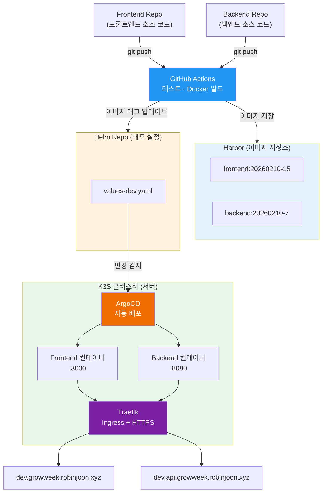

**한 문장으로 요약하면 이렇습니다.**

> 개발자가 코드를 push하면, GitHub Actions가 Docker 이미지를 만들어 Harbor에 보관하고, Helm 레포의 설정을 갱신하면, ArgoCD가 이를 감지해 K3S 클러스터에 자동 배포합니다.

**단계별로 풀면 4줄입니다.**

1. **Code** — 개발자가 코드를 push합니다.
2. **Build** — GitHub Actions가 코드를 Docker 이미지로 만들어 Harbor에 저장합니다.
3. **Config** — GitHub Actions가 Helm 레포의 설정 파일을 새 버전으로 갱신합니다.
4. **Deploy** — ArgoCD가 설정 변경을 감지하고, K3S 클러스터에 새 버전을 배포합니다.

이제부터 이 그림의 각 부분을 하나씩 설명합니다.

---

## 2. 이 문서의 비유 체계: "식당 운영"

이 문서는 전체 배포 구조를 **식당 운영**에 비유해서 설명합니다. 처음 보는 용어가 나오더라도 아래 표를 참고하면 금방 감이 잡힐 거예요.

| 기술 용어 | 식당 비유 | 한 줄 설명 |
|-----------|----------|-----------|
| **소스 코드** | 레시피 | 개발자가 작성하는 요리법 |
| **Dockerfile** | 도시락 포장 설명서 | "이 레시피를 이렇게 포장하세요"라는 지침 |
| **Docker 이미지** | 완성된 도시락 | 레시피대로 만들어 밀봉 포장한 상태. 어디서 열어도 같은 맛 |
| **컨테이너** | 식탁에 올라간 도시락 | 도시락을 실제로 열어서 서빙하는 중인 상태 |
| **Harbor (Registry)** | 도시락 보관 냉장고 | 포장된 도시락을 버전별로 정리해두는 창고 |
| **K3S (Kubernetes)** | 식당 | 도시락을 서빙하고, 자리를 관리하고, 문제가 생기면 교체하는 전체 공간 |
| **Helm** | 주문서 | "A도시락 2개, B도시락 1개를 3번 테이블에" 같은 배치 지시서 |
| **ArgoCD** | 식당 지배인 | 주문서를 계속 확인하며, 바뀐 내용이 있으면 즉시 식당에 반영하는 관리자 |
| **GitHub Actions** | 주방 자동화 로봇 | 레시피가 들어오면 검수하고, 도시락을 만들고, 주문서까지 갱신해주는 로봇 |
| **Ingress (Traefik)** | 식당 입구 안내원 | 손님(사용자)이 오면 올바른 테이블로 안내하는 역할 |
| **Service** | 홀 직원 | 안내원에게 받은 손님을 실제 도시락이 있는 자리까지 데려다주는 직원 |
| **Pod** | 서빙된 한 그릇 | 실제로 손님에게 나가는 최종 음식 단위 |

이제부터 위 비유를 일관되게 사용합니다. 기술 용어가 나올 때마다 괄호 안에 식당 비유를 병기할 거예요.

---

## 3. Vercel 배포 vs 우리 배포, 뭐가 다를까?

Vercel에서는 `git push`만 하면 알아서 빌드하고, 알아서 서버에 올려주고, 알아서 URL까지 만들어줍니다. 정말 편하죠. 하지만 그 "알아서" 뒤에는 사실 여러 단계가 숨어 있습니다.

식당 비유로 보면 이렇습니다.

**Vercel 배포** — 프랜차이즈 본사에 레시피만 보내면, 도시락 제조부터 배달까지 전부 알아서 해주는 구조입니다.

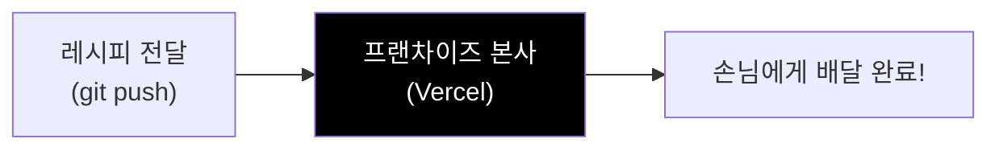

**GrowWeek 배포** — 우리가 직접 주방을 차리고, 도시락을 만들고, 냉장고에 보관하고, 주문서를 관리하고, 지배인이 서빙까지 챙기는 구조입니다.

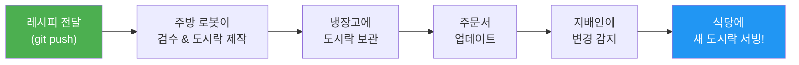

복잡해 보이지만, 하나씩 뜯어보면 전혀 어렵지 않습니다. 각 단계가 왜 필요한지 차근차근 알아볼게요.

---

## 4. 핵심 개념 하나씩 이해하기

### 4.1 Docker — "내 컴퓨터에서는 되는데요"의 해결책

개발하다 보면 "내 맥에서는 되는데 다른 컴퓨터에서는 안 된다"는 경험이 있을 거예요. Node.js 버전이 다르거나, 환경변수가 빠졌거나, OS가 달라서 생기는 문제입니다.

**Docker**는 이 문제를 해결합니다. 앱 실행에 필요한 모든 것(코드, Node.js, 설정 파일 등)을 하나의 **도시락**에 담아버리는 거예요. 이 도시락은 어떤 컴퓨터에서 열어도 동일하게 동작합니다.

도시락을 만드는 과정은 이렇습니다.

1. **도시락 포장 설명서(Dockerfile)를 작성합니다** — "Node.js 20 환경에서, 의존성 설치하고, 빌드해서 결과물만 담아라"
2. **주방 로봇(GitHub Actions)이 설명서대로 도시락을 만듭니다** — `npm ci` → `npm run build` → 빌드 결과물만 깔끔하게 포장
3. **완성된 도시락에 이름표(태그)를 붙입니다** — 예: `20260210-15` (날짜-빌드번호)

여기서 중요한 개념 두 가지가 있습니다.

- **Docker 이미지**(완성된 도시락) = 밀봉 포장이 완료된 상태. 아직 열지 않았습니다.
- **컨테이너**(식탁에 올라간 도시락) = 이미지를 실제로 열어서 실행 중인 상태입니다.

### 4.2 Harbor — 도시락 보관 냉장고

npm 패키지를 npmjs.com에 올리듯, 완성된 도시락(Docker 이미지)도 어딘가에 보관해야 합니다. GrowWeek은 **Harbor**라는 자체 냉장고를 운영하고 있습니다.

냉장고 안에는 버전별 도시락이 정리되어 있어요.

```
harbor.homelab.robinjoon.xyz/growweek/
├── frontend:20260130-14    ← 1월 30일에 만든 도시락
├── frontend:20260210-15    ← 2월 10일에 만든 도시락 (최신)
├── backend:20260210-7      ← 백엔드 도시락
└── ...
```

이렇게 버전별로 보관하니까, 문제가 생기면 이전 도시락으로 돌아갈(롤백할) 수도 있습니다.

### 4.3 K3S (Kubernetes) — 식당 그 자체

도시락 하나를 식탁에 올리는 건 쉽습니다. 하지만 실제로 식당을 운영하려면 고민이 많아지죠.

- 도시락이 상했으면(컨테이너 장애) 자동으로 새 걸로 교체해야 하고
- 손님이 많아지면(트래픽 증가) 도시락을 더 준비해야 하고
- 메뉴가 바뀌면(새 버전 배포) 손님 불편 없이 슬쩍 교체해야 합니다

이런 일을 자동으로 해주는 게 **Kubernetes**(줄여서 K8s)입니다. 도시락들을 알아서 관리해주는 **식당 운영 시스템**이라고 생각하면 됩니다.

**K3S**는 Kubernetes의 경량 버전입니다. 기능은 거의 동일한데 설치와 운영이 훨씬 가벼워요. GrowWeek은 자체 서버에 K3S를 설치해서 식당(클러스터)을 운영하고 있습니다.

K3S가 자동으로 해주는 일들을 정리하면 이렇습니다.

| 상황 | K3S가 하는 일 |
|------|-------------|
| 도시락이 상함 (컨테이너 장애) | 자동으로 새 도시락 교체 (자동 재시작) |
| 손님 폭주 (트래픽 증가) | 도시락 수량 자동 증가 (오토스케일링) |
| 메뉴 변경 (새 버전 배포) | 새 도시락 먼저 준비 후 기존 도시락 교체 (롤링 업데이트) |
| 도시락 상태 확인 | 주기적으로 맛 검사 (헬스체크) |

### 4.4 Helm — 주문서

프론트엔드에 npm이 있다면, Kubernetes에는 **Helm**이 있습니다.

식당(K3S)에 도시락을 세팅하려면 다양한 지시가 필요합니다. "어떤 도시락을 몇 개 올릴지", "몇 번 테이블에서 서빙할지", "입구에서 어떻게 안내할지" 같은 것들이요. Helm은 이런 지시사항들을 하나의 **주문서(차트)**로 묶어서 관리합니다.

npm에서 `package.json`에 설정을 적듯, Helm에서는 `values.yaml`에 설정을 적습니다.

그런데 개발용 식당과 운영용 식당의 세팅이 다를 수 있잖아요? 이를테면 개발 환경은 도시락 1개만 서빙하고, 운영 환경은 도시락 3개를 서빙하고 싶을 수 있습니다. 이런 환경별 차이를 관리하기 위해 주문서를 나눠서 쓸 수 있습니다.

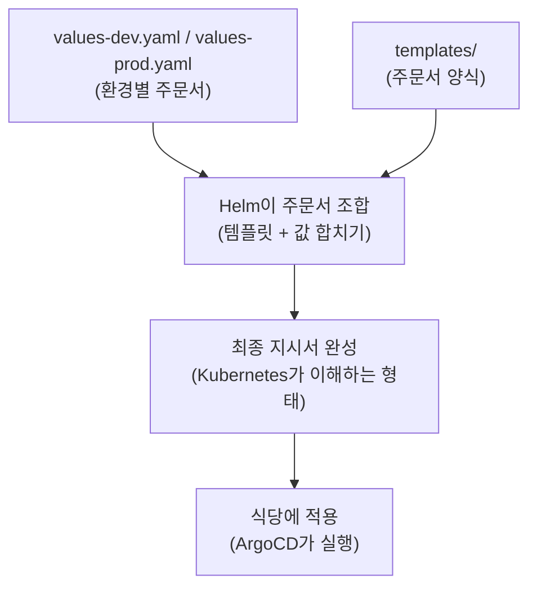

### 4.5 ArgoCD — 식당 지배인

**ArgoCD**는 GitOps 도구입니다. GitOps란 **"주문서(Git 레포)에 적힌 내용이 곧 식당의 실제 상태"**라는 철학이에요.

식당 지배인(ArgoCD)은 주문서 보관함(Helm 레포)을 계속 감시합니다. 누군가 주문서를 고치면 — "어? A도시락이 v1.1에서 v1.2로 바뀌었네?" — 즉시 식당에 반영합니다. 냉장고에서 새 도시락을 꺼내고, 기존 도시락을 치우고, 새 도시락을 서빙합니다.

사람이 직접 식당에 가서 도시락을 교체하지 않아도 됩니다. **주문서 수정 = 배포 명령**인 셈이죠.

---

## 5. 레포지토리 구조

GrowWeek의 배포 시스템은 **3개의 GitHub 레포지토리**로 구성되어 있습니다.

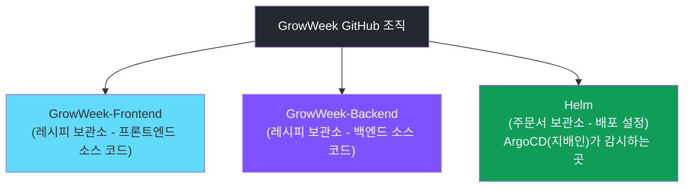

**왜 레포지토리를 분리했을까요?**

레시피(소스 코드)와 주문서(배포 설정)를 분리한 이유는 **관심사의 분리**입니다. "무엇을 만들 것인가"와 "어떻게 서빙할 것인가"를 독립적으로 관리하면, 주문서만 바꿔야 할 때 레시피를 건드릴 필요가 없고, 그 반대도 마찬가지입니다.

### Helm 레포 내부 구조

```
Helm/
├── frontend/
│   ├── Chart.yaml              ← 주문서 표지 (이름, 버전 정보)
│   ├── values.yaml             ← 기본 주문 내용 (모든 환경 공통)
│   ├── values/
│   │   ├── values-dev.yaml     ← 개발 식당용 주문서 (ArgoCD가 보는 파일)
│   │   └── values-landing.yaml ← 랜딩 페이지 전용 주문서
│   └── templates/              ← 주문서 양식 모음
│       ├── deployment.yaml     ← "도시락을 어떻게 서빙할지"
│       ├── service.yaml        ← "홀 직원 배치를 어떻게 할지"
│       └── ingress.yaml        ← "입구 안내를 어떻게 할지"
│
└── backend/
    ├── (frontend와 동일한 구조)
    └── ...
```

`values-dev.yaml`은 "개발 식당에서 도시락을 어떤 모습으로 서빙할지"를 정의합니다.

- **어떤 도시락을 쓸지**: `harbor.homelab.robinjoon.xyz/growweek/frontend:20260210-15`
- **식당 간판(도메인)**: `dev.growweek.robinjoon.xyz`
- **보안 인증서(HTTPS)**: Let's Encrypt로 자동 발급
- **환경변수**: `API_BASE_URL=https://dev.api.growweek.robinjoon.xyz`
- **상태 점검(헬스체크)**: 포트 3000의 `/` 경로로 확인

배포할 때 주방 로봇이 바꾸는 건 이 중에서 **도시락 버전(이미지 태그) 딱 한 줄**뿐입니다. 나머지 설정은 인프라 담당자가 필요할 때 직접 수정합니다.

---

## 6. 배포 상세 흐름: 코드 한 줄이 서비스가 되기까지

섹션 1의 전체 그림을 기억하시죠? 이제 그 흐름을 단계별로 자세히 따라가 봅니다.

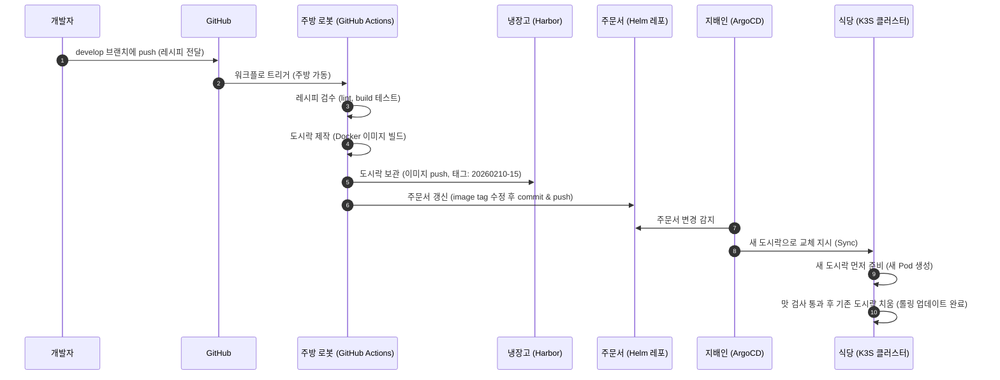

### Step 1. 레시피 전달 — 코드 Push

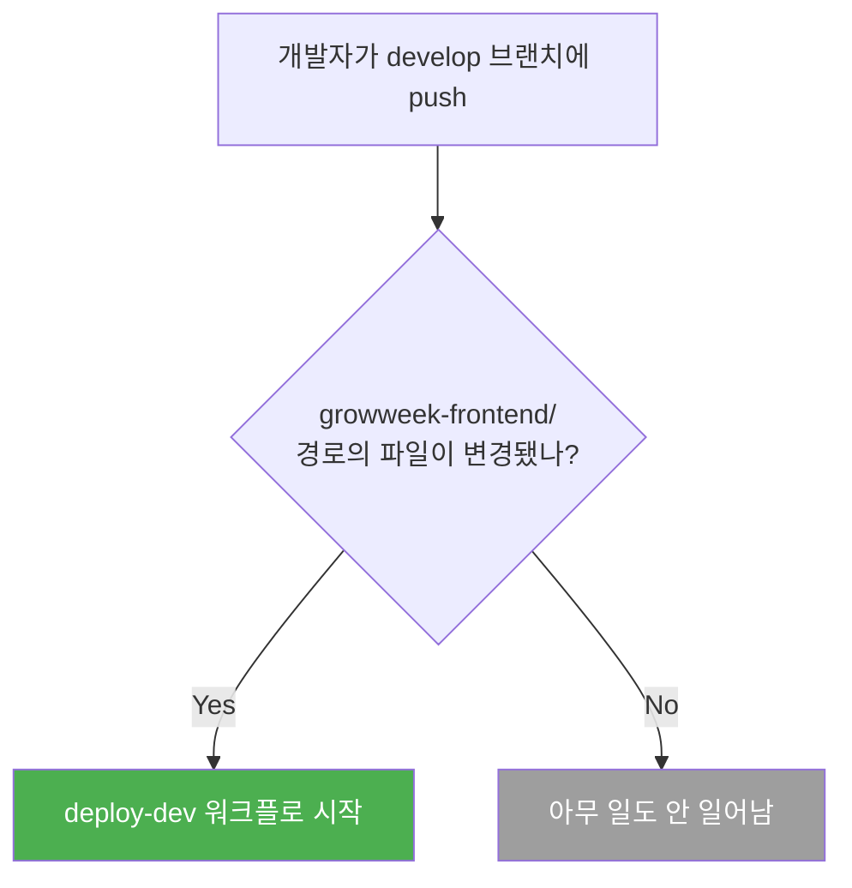

개발자가 `develop` 브랜치에 코드를 push하면, 주방 로봇(GitHub Actions)이 깨어납니다. 단, `growweek-frontend/` 하위 파일이 바뀐 경우에만 작동합니다. README만 수정했다고 배포가 일어나지는 않으니 안심하세요.

### Step 2. 레시피 검수 — 테스트

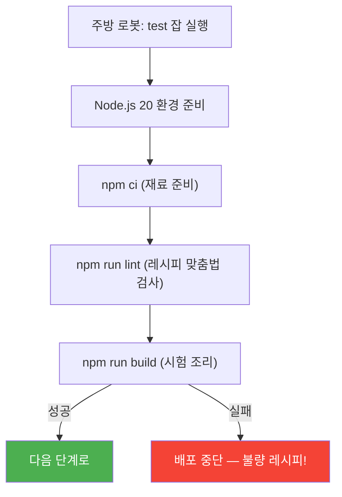

주방 로봇이 가장 먼저 하는 일은 **레시피 검수**입니다. lint와 빌드가 실패하면 이후 단계는 진행되지 않습니다. 상한 재료로 도시락을 만들 순 없으니까요. 깨진 코드가 서비스에 나가는 것을 막는 안전장치입니다.

### Step 3. 도시락 제작 & 냉장고 보관 — Docker 빌드 & Harbor Push

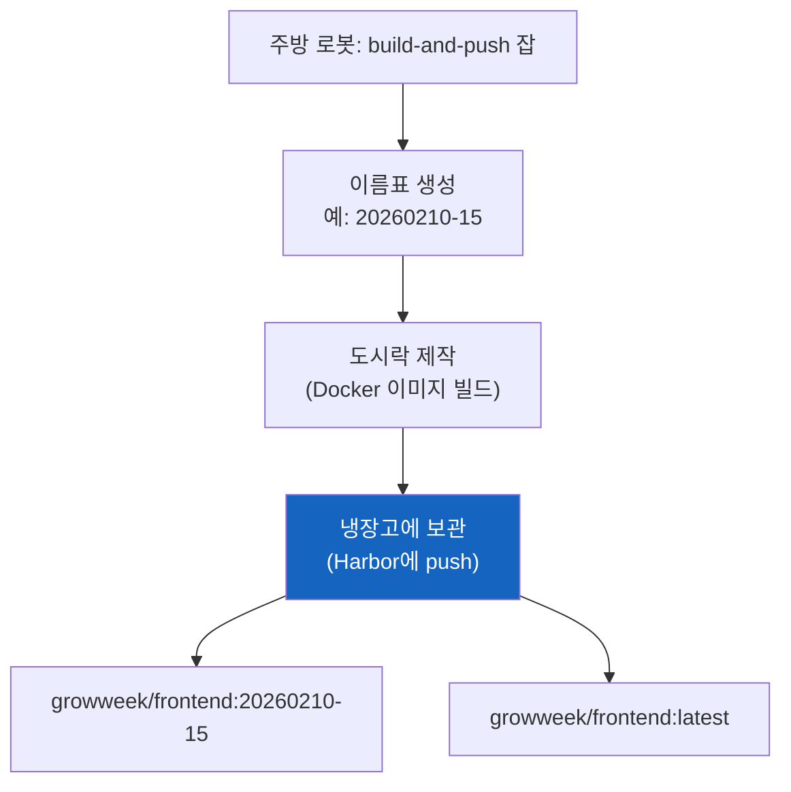

검수를 통과한 레시피로 도시락을 만듭니다. 도시락에는 `날짜-빌드번호` 형태의 이름표(태그)가 붙습니다(예: `20260210-15`). 이 이름표가 "어떤 시점의 레시피로 만든 도시락인지"를 식별하는 버전 역할을 합니다.

완성된 도시락은 냉장고(Harbor)에 보관됩니다.

### Step 4. 주문서 갱신 — Helm 레포 업데이트 (핵심!)

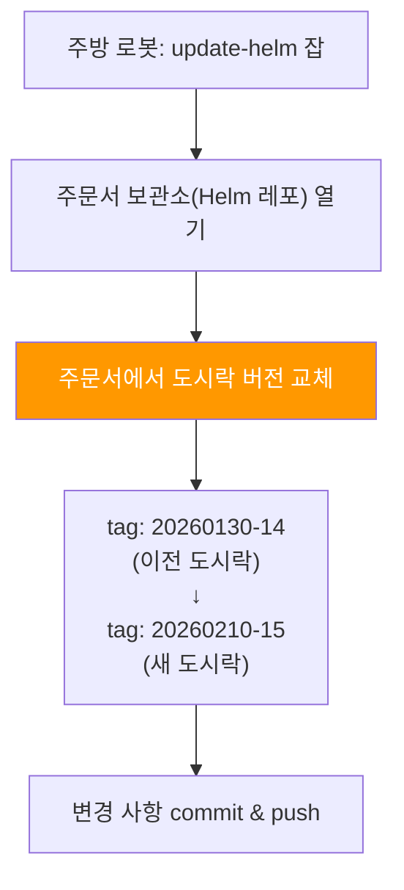

이 단계가 전체 흐름에서 **가장 중요한 연결 고리**입니다.

주방 로봇이 주문서 보관소(Helm 레포)를 열어서, `values-dev.yaml` 안의 도시락 버전(이미지 태그)을 방금 만든 새 버전으로 바꿉니다. 이 한 줄의 수정이 **"이제 새 도시락을 쓰세요"**라는 지시가 됩니다.

### Step 5. 지배인 출동 — ArgoCD 감지 & 배포

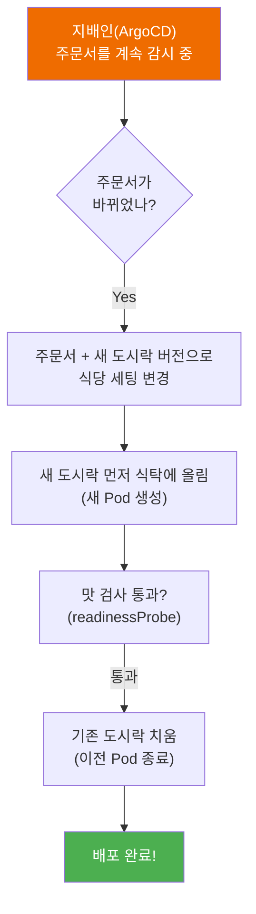

지배인(ArgoCD)은 주문서(Helm 레포)를 항상 지켜보고 있습니다. Step 4에서 주문서가 바뀌면, 지배인이 이를 감지하고 식당(K3S)에 반영합니다.

이때 **롤링 업데이트**가 실행됩니다. 새 도시락을 먼저 식탁에 올리고, 맛 검사(readinessProbe)를 통과하면 기존 도시락을 치웁니다. 덕분에 **배포 중에도 손님(사용자)은 서비스 중단 없이** 이용할 수 있습니다.

### Step 6. 손님 입장 — 사용자 접속

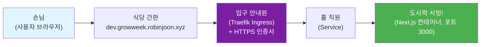

손님이 식당 간판(도메인)을 보고 찾아오면, 입구 안내원(Traefik)이 맞이합니다. HTTPS 인증서는 cert-manager와 Let's Encrypt를 통해 자동으로 발급됩니다. 안내원은 손님을 홀 직원(Service)에게 넘기고, 홀 직원이 실제 도시락(컨테이너)이 있는 자리로 안내합니다.

정리하면, 외부 접근은 항상 이 경로를 따릅니다.

> **입구 안내원(Ingress) → 홀 직원(Service) → 서빙된 도시락(Pod)**

---

## 7. 헬스체크 — 도시락 상태 점검

식당에서 상한 음식을 손님에게 내보내면 안 되겠죠? K3S는 두 가지 상태 점검을 자동으로 수행합니다.

| 점검 종류 | 식당 비유 | 실패 시 대응 |
|-----------|----------|-------------|
| **readinessProbe** | "이 도시락 서빙해도 될까?" 확인 | 실패하면 손님에게 안 내보냄 (트래픽 차단) |
| **livenessProbe** | "이 도시락 상하지 않았나?" 확인 | 실패하면 도시락 폐기 후 새로 준비 (컨테이너 재시작) |

이 점검 덕분에 장애가 발생해도 자동으로 복구됩니다. 개발자가 직접 서버에 접속해서 뭔가를 할 필요가 없어요.

---

## 8. 환경별 배포 현황

현재 GrowWeek은 다음 환경들을 운영하고 있습니다.

| 환경 | 용도 | 프론트엔드 URL | 백엔드 URL | 배포 방식 |
|------|------|---------------|-----------|----------|
| Dev | 개발/테스트 | `dev.growweek.robinjoon.xyz` | `dev.api.growweek.robinjoon.xyz` | develop push 시 자동 |
| Landing | 랜딩 페이지 | `growweek.team.io.kr` | — | 수동 트리거 |

---

## 9. Vercel과의 비교 요약

| 항목 | Vercel (프랜차이즈) | GrowWeek (자체 식당) |
|------|-------------------|---------------------|
| 트리거 | git push | git push (develop 브랜치) |
| 빌드 | 본사가 알아서 | 주방 로봇 (GitHub Actions) |
| 이미지 저장 | 해당 없음 | 냉장고 (Harbor) |
| 배포 설정 | 본사 대시보드 | 주문서 (Helm, Git으로 관리) |
| 배포 실행 | 본사가 알아서 | 지배인 (ArgoCD, 자동 감지) |
| 서버 | 본사 CDN/Edge | 자체 식당 (K3S 클러스터) |
| HTTPS | 자동 | cert-manager + Let's Encrypt |
| 롤백 | 대시보드 1클릭 | 주문서에 이전 도시락 버전 적기 or ArgoCD 롤백 |
| 인프라 통제 | 낮음 (본사 규칙 따라야 함) | 매우 높음 (우리 식당이니까) |

핵심 차이는 **인프라 소유권**입니다. Vercel은 모든 것을 대신 해주지만 우리가 통제할 수 없는 부분이 있고, GrowWeek 구조는 모든 것을 직접 관리하기 때문에 자유도가 높은 대신 복잡도도 높습니다.

---

## 10. 이 구조의 핵심 철학 — GitOps

이 모든 구조를 관통하는 하나의 철학이 있습니다.

> **"주문서(Git)에 적힌 내용이 곧 식당(서버)의 실제 상태다."**

1. **도시락 포장 설명서를 코드로 관리한다** — Dockerfile로 실행 환경을 정의
2. **식당 상태를 주문서(Git)로 관리한다** — Helm 레포에 모든 배포 설정을 기록
3. **사람이 식당에 직접 들어가지 않는다** — 서버에 SSH로 접속해서 뭔가 하지 않음
4. **한 번 포장한 도시락은 바꾸지 않는다** — 불변 이미지로 배포의 일관성 보장

이것이 GitOps의 핵심이고, GrowWeek 배포 구조의 근간입니다.

---

## 11. 프론트엔드 개발자를 위한 FAQ

### "내가 push하면 배포까지 얼마나 걸려요?"

보통 3~5분 정도 소요됩니다. GitHub Actions 탭에서 진행 상황을 실시간으로 확인할 수 있어요.

### "배포가 안 되는 것 같아요"

아래 순서로 확인해보세요.

1. **GitHub Actions 탭** → `deploy-dev` 워크플로 확인. 빨간 X가 있으면 로그를 살펴보세요.
2. `growweek-frontend/` 경로의 파일을 수정했는지 확인. 루트의 `CLAUDE.md` 같은 파일만 바꾸면 워크플로가 트리거되지 않습니다.
3. `develop` 브랜치에 push했는지 확인. 다른 브랜치에서는 배포 워크플로가 실행되지 않습니다.

### "환경변수를 추가하고 싶어요"

런타임 환경변수는 주문서(`Helm/frontend/values/values-dev.yaml`)의 `env` 섹션에서 관리합니다. 추가가 필요하면 인프라 담당자에게 요청하거나, 해당 파일에 직접 PR을 보내면 됩니다.

### "PR 올리면 뭐가 자동으로 돌아가나요?"

`growweek-frontend/` 경로의 파일이 변경된 PR에 대해 `frontend-test.yml` 워크플로가 자동 실행됩니다. lint와 빌드를 돌려서 머지 전에 문제를 잡아줍니다. 이건 배포까지는 가지 않고, 레시피 검수만 합니다.

### "도커나 쿠버네티스 명령어를 공부해야 하나요?"

**아닙니다!** 당장은 몰라도 됩니다. 코드 로직에 집중해주세요. 식당이 도시락을 어떻게 서빙하는지는 이 문서 정도만 이해하고 계시면 충분합니다.

---

## 용어 사전

| 용어 | 식당 비유 | 설명 |
|------|----------|------|
| **Docker** | 도시락 포장 도구 | 앱과 실행 환경을 하나로 묶어 어디서든 동일하게 실행할 수 있게 해주는 도구 |
| **Docker 이미지** | 완성된 도시락 | 코드 + 런타임 + 설정이 모두 포함된 불변 패키지 |
| **컨테이너** | 열린 도시락 | 이미지를 실제로 실행한 상태의 프로세스 |
| **Dockerfile** | 포장 설명서 | 이미지를 어떻게 만들지 정의하는 설계도 |
| **Harbor** | 냉장고 | Docker 이미지를 버전별로 저장하는 보관소 (npm registry 같은 역할) |
| **K3S** | 식당 | 경량 Kubernetes. 컨테이너들을 자동으로 관리하는 시스템 |
| **Helm** | 주문서 | Kubernetes의 패키지 매니저. 배포 설정을 관리하는 도구 (npm 같은 역할) |
| **Helm 차트** | 주문서 묶음 | 배포에 필요한 설정 파일 모음 (package.json + 실행 스크립트 같은 것) |
| **values.yaml** | 주문 내용 | 환경별 설정값 파일 (.env 파일과 비슷한 역할) |
| **ArgoCD** | 지배인 | Git 레포를 감시하다가 변경이 생기면 자동 배포하는 도구 |
| **GitOps** | — | "Git에 있는 설정 = 서버의 실제 상태"라는 운영 철학 |
| **Ingress** | 입구 안내원 | 외부 요청을 클러스터 내부 서비스로 연결해주는 규칙 |
| **Traefik** | 입구 안내원 (구체적 이름) | K3S에 기본 내장된 리버스 프록시/Ingress 컨트롤러 |
| **Service** | 홀 직원 | Pod가 바뀌어도 주소가 바뀌지 않는 고정 내부 엔드포인트 |
| **Pod** | 서빙된 한 그릇 | 실제로 앱이 실행되는 최소 단위 |
| **cert-manager** | 보안 담당 | HTTPS 인증서를 자동으로 발급/갱신해주는 도구 |
| **롤링 업데이트** | 손님 모르게 교체 | 새 버전을 먼저 띄우고 구 버전을 내리는 무중단 배포 방식 |
| **GitHub Actions** | 주방 로봇 | GitHub에서 코드 push 시 자동으로 작업을 실행하는 CI/CD 도구 |
